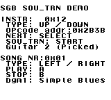

# SGB SOU_TRN example

This code demonstrates howto play custom SNES music using the built in N-SPC driver of the SGB.
It transfers song data to the SGB using the 'SOU_TRN' command.
Additionally as a gimmick it has basic functionality to change the instruments that the song uses (however, no samples are changed).

It was tested on a PAL SGB.

This code is based on [gbdk](https://github.com/gbdk-2020/gbdk-2020) sgb_sfx and sgb_border code.

[Download ROM](https://github.com/cloudsmon/sgb_nspc_music/releases/download/v1.0.0/sgb_mus.gb) (or go to Releases)

## Build instructions

Requirements: 
* gbdk ver >= 4.2.0 for compiling the ROM
* gbdk & python3 for recompiling nspc_music.s (only needed if song data changed)

Linux:
* set $GBDKDIR and type make

## Changing Song Data

Song data can be changed by modifying nspc_music.s

Technical details:
The build process is a bit of a hack, but it works (because GB and SPC700 are both little endian and the only needed instructions are db and dw).
Song data is compiled by sdasgb into a gb rom as a temporary step, 'extract_nspc.py' will then turn the relevant data of the ROM into a C array which can be included in the main application.
This is all done automatically when invoking the Makefile.

## Useful links / resources

* [N-SPC Engine](https://sneslab.net/wiki/N-SPC_Engine): general info; lists all commands, very technical
* [SNES Sound Driver List](http://gdri.smspower.org/wiki/index.php/Super_Famicom/Super_NES_Sound_Driver_List): lists which games use which sound driver
* [EBmusEd](https://github.com/PKHackers/ebmused): Earthbound seems to use the same VCMDs 
* [Tutorial on EBmused](https://www.youtube.com/watch?v=1Wp5sS8UWBg&list=PLo-SH6FNUdp0LgsY6s6xs-JO1ENke--Kw): very similar to inputting raw VCMD hex commands

### EBmusEd Code List (VCMDs)
_copied from [EBmusEd help.c](https://github.com/PKHackers/ebmused/blob/master/src/help.c)_

_Not tested in its entirety, but seems to be the same as SGB's VCMDs_

00: End of pattern or subroutine
(Don't use this in the editor; it automatically
inserts this where necessary when compiling)

01-7F: Set note length

		normal	triplet
	whole	60	40
	half	30	20
	quarter	18	10
	eighth	0C	08
	16th	06	04
	32nd	03	02

	May be optionally followed by another byte to set note style:
		First nybble: 0-7, release time
		Second nybble: 0-F, volume

-----------------------

80-C7: Notes

	  C  C# D  D# E  F  F# G  G# A  A# B
	1 80 81 82 83 84 85 86 87 88 89 8A 8B
	2 8C 8D 8E 8F 90 91 92 93 94 95 96 97
	3 98 99 9A 9B 9C 9D 9E 9F A0 A1 A2 A3
	4 A4 A5 A6 A7 A8 A9 AA AB AC AD AE AF
	5 B0 B1 B2 B3 B4 B5 B6 B7 B8 B9 BA BB
	6 BC BD BE BF C0 C1 C2 C3 C4 C5 C6 C7
(note C-1 is too low to play without a finetune of at least 26)

C8: Continue previous note

C9: Rest

CA-DF: Set instrument and play note C-4. Usually used for drums.
The instrument used is equal to the code minus CA plus
the base instrument number set by [FA].

-----------------------

[E0 instrument]
Set instrument. The parameter can either specify an instrument
number directly, or it can be a value from CA onward, in which case
it is relative to the CA base instrument set by [FA].

[E1 panning]
Set channel panning. 00 = right, 0A = middle, 14 = left

[E2 time panning]
Slide channel panning

[E3 start speed range]
Vibrato on. If range is <= F0, it is in 1/256s of a semitone;
if range is F1-FF then it is in semitones.

[E4]
Vibrato off

[E5 volume]
Set global volume

[E6 time volume]
Slide global volume

[E7 tempo]
Set tempo

[E8 time tempo]
Slide tempo

[E9 transpose]
Set global transpose

[EA transpose]
Set channel transpose

[EB start speed range]
Tremolo on

[EC]
Tremolo off

[ED volume]
Set channel volume

[EE time volume]
Slide channel volume

[EF addr-lo addr-hi count]
Call a subroutine the given number of times.
In the editor, use the *s,n syntax instead.

[F0 time]
Set vibrato fadein time

[F1 start length range]
Portamento on. Goes from note to note+range

[F2 start length range]
Portamento on. Goes from note-range to note

[F3]
Portamento off

[F4 finetune]
Sets channel finetune (in 1/256 of a semitone)

[F5 channels lvol rvol]
Echo on (not implemented)

[F6]
Echo off (not implemented)

[F7 delay feedback filter]
Set echo settings (not implemented)

[F8 time lvol rvol]
Slide echo volumes (not implemented)

[F9 start length note]
Note portamento. This goes after a note and only affects that note.

[FA instrument]
Set the first instrument to be used by CA-DF codes
In EarthBound, this is always set to the first instrument of the
second pack, but this is not required.

[FB ?? ??]
Does nothing

[FC]
Mute channel (debug code, not implemented)

[FD]
Fast-forward on (debug code, not implemented)

[FE]
Fast-forward off (debug code, not implemented)

[FF]
Invalid